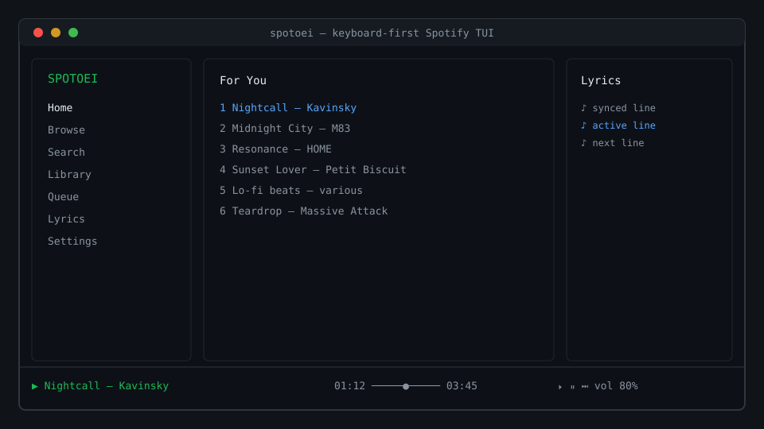

# SPOTOEI

A keyboard-first, terminal-native Spotify client with a Winamp-inspired visualizer, synced
lyrics, and local playback through [librespot](https://github.com/librespot-org/librespot).



> Unofficial project. Not affiliated with, endorsed by, or sponsored by Spotify. Spotify is a
> trademark of Spotify AB. A Spotify Premium account is required for playback.

## Features

- **Local playback** via a bundled Rust/librespot sidecar — no official client needed.
- **Keyboard-first TUI** built on [OpenTUI](https://opentui.com): vim motions, command palette, context menus.
- **Visualizer**: spectrum, Winamp-style bars, oscilloscope, and circular modes driven by the decoded PCM stream.
- **Synced lyrics** with plain-text fallback.
- **Search, library, playlists, albums, artists, queue, and Home** tabs.
- **Cover art** in terminals that support kitty/sixel graphics (text-block fallback elsewhere).
- **OS media controls**: MPRIS on Linux, media keys on macOS/Windows.
- **Privacy by default**: credentials live in the OS keyring, never in config or cache.

## Requirements

- Spotify **Premium** account
- A terminal with modern Unicode support
- An audio output device (for local playback)
- A browser for the OAuth login
- Your own Spotify Developer application Client ID (see [Configuration](docs/CONFIGURATION.md))

Packaged releases need no Bun, Node.js, Rust, or librespot installation.

## Install

One command per platform. The script downloads the latest release, verifies the SHA-256
checksum, and installs to `~/.local` (Linux/macOS) or `%LOCALAPPDATA%\Programs\spotoei`
(Windows).

**Linux / macOS**

```sh
curl -fsSL https://raw.githubusercontent.com/amaruki/spotoei/main/scripts/install.sh | sh
```

**Windows (PowerShell)**

```powershell
irm https://raw.githubusercontent.com/amaruki/spotoei/main/scripts/install.ps1 | iex
```

Prefer to review before running? Download the script and read it first:

```sh
curl -fsSLO https://raw.githubusercontent.com/amaruki/spotoei/main/scripts/install.sh
less install.sh && sh install.sh
```

Pin a version with `SPOTOEI_VERSION=0.0.0` (Linux/macOS) or `$env:SPOTOEI_VERSION="0.0.0"`
(Windows). The installer adds its bin directory to your `PATH`, so once it finishes you can
start the client with `spotoei`. Manual archive installs, runtime packages, and uninstall are
in [docs/INSTALL.md](docs/INSTALL.md).

## Run

```sh
spotoei
```

The first run walks through the Spotify Client ID and the PKCE login flow in your browser.
Verify the setup any time with `spotoei doctor`.

### Keys

| Key           | Action                         |
| ------------- | ------------------------------ |
| `?` / `:`     | Command palette                |
| `Space` / `k` | Play / pause                   |
| `n` / `p`     | Next / previous                |
| `/`           | Search                         |
| `r`           | Library                        |
| `u`           | Queue                          |
| `l` / `L`     | Lyrics view / reload lyrics    |
| `v` / `m`     | Visualizer toggle / cycle mode |
| `1`–`7`       | Jump between main views        |
| `Tab`         | Switch focus                   |
| `Esc`         | Back                           |
| `q`           | Quit                           |

Full reference: [docs/KEYBINDINGS.md](docs/KEYBINDINGS.md).

### CLI

```sh
spotoei search <query>                  # non-interactive search
spotoei authenticate                    # force fresh logins
spotoei doctor [check]                  # verify binary, audio, auth, database
spotoei config set-client-id <id>
spotoei config set-redirect-port <port>
```

## Build from source

Requires [Bun](https://bun.sh) ≥ 1.3 and a Rust toolchain ≥ 1.80. On Linux, install ALSA and
PulseAudio development headers first (`libasound2-dev libpulse-dev pkg-config` on Debian/Ubuntu).

```sh
bun install
bun run dev        # builds the Rust sidecar and starts the TUI
```

Other commands:

```sh
bun run start      # run against an already-built sidecar
bun test           # TypeScript tests (also: cargo test -p spotoei-player)
bun run lint       # oxlint + 300 LoC check
bun run typecheck
bun run package    # build both binaries into dist/
```

See [docs/DEVELOPMENT.md](docs/DEVELOPMENT.md) for details.

## Documentation

- [Install guide](docs/INSTALL.md)
- [Configuration](docs/CONFIGURATION.md)
- [Keybindings](docs/KEYBINDINGS.md)
- [Troubleshooting](docs/TROUBLESHOOTING.md)
- [Development](docs/DEVELOPMENT.md)
- [Technical specifications](docs/TSD/00-index.md) and [documentation index](docs/README.md)

## Contributing

Issues and pull requests are welcome. Read [CONTRIBUTING.md](CONTRIBUTING.md) first.
Security reports: [SECURITY.md](SECURITY.md). Community expectations:
[CODE_OF_CONDUCT.md](CODE_OF_CONDUCT.md).

## License

[MIT](LICENSE) © 2026 SPOTOEI contributors.
